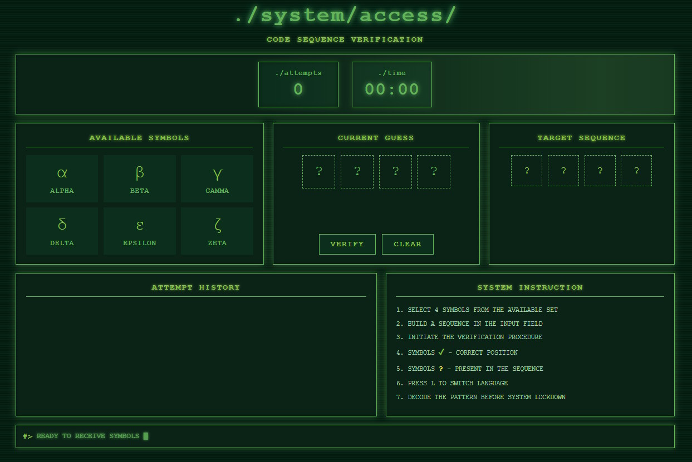

# 🧠 03_guess_puzzle

An HTML deduction puzzle where players assemble a symbolic code sequence, submit guesses, read feedback, and iteratively decode the correct combination.

## Overview

This puzzle is designed like a strange system verification terminal. Players choose four symbols from a limited symbolic set and submit a guess. The system then reports whether symbols are in the correct position or merely present somewhere in the target sequence.

The result is a compact logic puzzle that feels like a code-breaking console rather than a modern app.

## Core Mechanics

- The hidden sequence contains 4 symbols
- The player builds a guess from 6 available symbols
- After each guess, the puzzle returns:
- `✓` for a symbol in the correct position
- `?` for a symbol that exists in the sequence but is placed incorrectly
- `○` for the remaining unmatched slots in history
- The player uses attempt history to refine the next guess

## Controls

- mouse click on a symbol: add it to the current guess
- `VERIFY`: submit the current 4-symbol guess
- `CLEAR`: reset the current unfinished guess
- `L`: switch interface language between English and Russian

## Layout

The current version is arranged as a dense two-row desktop layout:

- top row: available symbols, current guess, target sequence
- bottom row: attempt history, system instruction

This makes the puzzle fit a full screen more naturally and keeps all critical information visible at once.

## Files

- `index.html`: interface structure and text anchors
- `style.css`: terminal styling, layout, and responsive behavior
- `script.js`: game logic, feedback calculation, language switching, and audio
- `button-click.mp3`, `piece-select.mp3`, `piece-swap.mp3`, `shuffle-sound.mp3`, `tick.mp3`, `win-sound.mp3`: sound effects

## Language Support

The puzzle starts in English.

Press `L` at any time to switch between:

- English
- Russian

Language switching updates:

- headers and buttons
- instructions
- symbol names
- console messages
- win screen text
- revealed final code labels

## Running the Puzzle

Open `index.html` in a browser. No install or build step is required.

## Session Use Ideas

This puzzle is a good fit for:

- decoding an occult machine interface
- unlocking a laboratory archive terminal
- interpreting a ritual control sequence
- restoring access to a damaged security console

It works best when the code itself gates an important reveal, document, or next scene transition.
